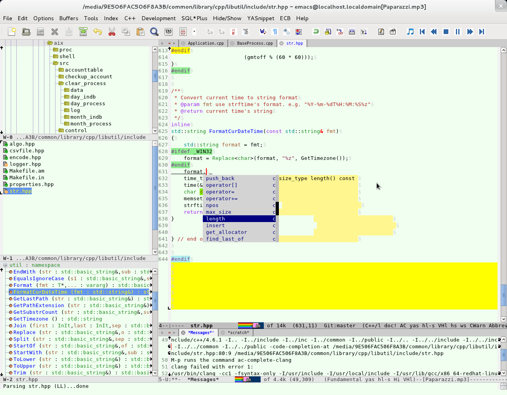

# Readme #

- 这是Liu Xin的emacs配置文件，只支持emacs24以上版本，我用emacs主要进行C++开发和用org管理TODO，有时候也写点python。
- bin目录用来保存windows下的可执行文件，比如windows默认没有的grep等。
- elpa目录保存package.el安装的插件。
- lisp目录是非package.el管理的elisp插件。
- init目录是我的emacs配置。
- etc/images目录是toolbar用的图标文件。
- etc/sample是一些文件示例。
- etc/snippets目录是yasnippet的snippets定义。
- etc/templates目录是autoinsert模板。

# Install #

- git clone http://git.oschina.net/meteor1113/dotemacs.git
- 把etc/sample/.emacs拷贝到$HOME目录下，修改load-path为dotemacs的实际路径，根据需要可注释掉部分内容。
- 如果需要cedet，可以从 http://cedet.sourceforge.net 下载cedet并安装（比如安装到~/.emacs.d/lisp目录下）。
- 如果需要用jdee开发java，可以从 http://jdee.sourceforge.net 下载jdee并安装，安装位置可参考cedet。
- 如果需要用ropemacs开发python，可以分别从 http://rope.sourceforge.net ， http://pymacs.progiciels-bpi.ca/pymacs.html ， http://rope.sourceforge.net/ropemacs.html 下载rope，pymacs，ropemacs并安装，把pymacs编译时生成的pymacs.el文件安装到emacs里，安装位置可参考cedet。（注意ropemacs需要下载snapshot版，release的版本不能补全）
- 如果需要开发go，除了go编译器外，还需要安装godef，gocode。还要配置好环境变量GOROOT，GOPATH。
- 如果需要开发rust，除了rustc外，还需要安装cargo，rustfmt，racer。还要配置好环境变量RUST_SRC_PATH。

# Screenshot #

# Email #

- meteor1113@qq.com
